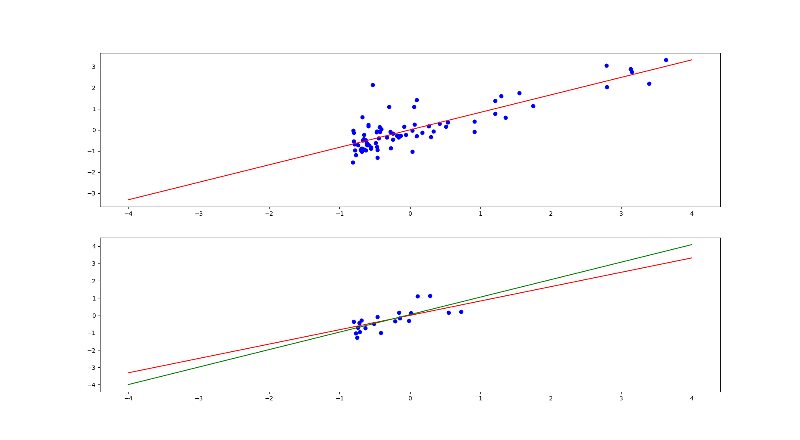
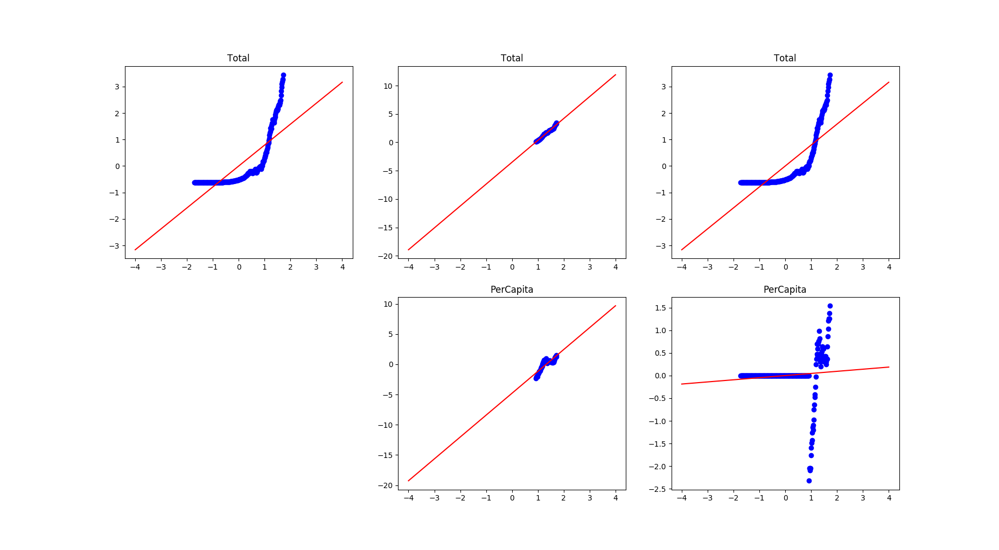
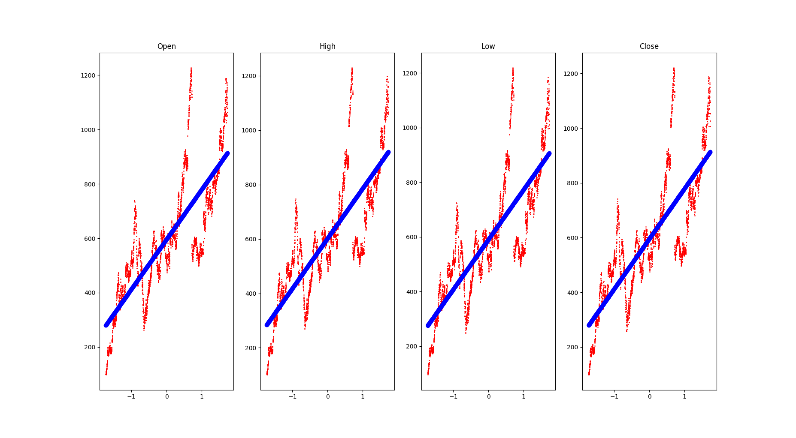

# Отчет по лабораторной работе
## по курсу "Искусственый интеллект"

## Линейная регрессия

### Студент: Сахарин Н.А.

## Результат проверки

| Преподаватель     | Дата         |  Оценка       |
|-------------------|--------------|---------------|
| Самир Ахмед |              |               |

> *Комментарии проверяющих*

## Тема работы

  Реализовать модель линейной регрессии для набора данных. Метод линейной регрессии заключается в том, что сначала выдвигается предположение, что значения одной из переменных линейно зависят от каждой из некоторого набора других переменных.
  
Например, пусть значения переменной Z линейно с некоторым коэффициентом A зависят от значений переменной Y, в тоже время экспоненциальному росту переменной X соответствует линейный рост значений Z. В таком случе можно условно записать:

Z ~ Y + log(X), что означает, что некоторому приращению dY значения Y соответствует пропорциональное dZ = A * dY приращение переменной Z. Аналогичной утверждение справедливо для log(x): dZ = B * d(log(X)).

## Решение

  Для начала, у нас заданно 3 датасета, 2 из которых приложены к заданию, оставшийся необходимо извлечь из 'Wiki/GOOGL', с помощью quandl.
В каждом из трех датасетов работа происходит следующим образом.
  1) Данные нормируются.
  2) Выбираются свободные и зависимые переменные.
  3) Вычисляются коэффициенты линейной регрессии. В простейшем случае, например Y ~ X - это числа A и B, выбранные таким образом, что сумма квадратов Yi - (A * Xi + B) по всем i, минимальна.
  4) Построение графиков для визуализации полученных результатов.
Код содержит достаточное количество коментариев.

challenge_dataset

global_co2

Wiki/GOOGL

## Выводы
  Подробнее хотелось бы обсудить датасет global_co2. Который отражает выделение углекислого газа в зависимости от года. Рассмотрим значения 'Per Capita' и 'Total', отражающие выделение на душу населения и в совокупное выделение соответственно. В качестве свободной переменной веберем год и проанализируем зависимость 'Per Capita' + 'Total' ~ 'Year'.

  Очень интересным и в тоже время вполне логичным для меня явилось то, что по получившемуся графику проглядывается экспоненциальная зависимость совокупного выеления углекислого газа от года. Это соответствует предположению о том, что человечество развивается экспоненциально. Что, например, подтверждается Законом Мура, работавшим до недавнего времени относительно частот, а сейчас относительно кол-ва вычислительных блоков/ядер.
